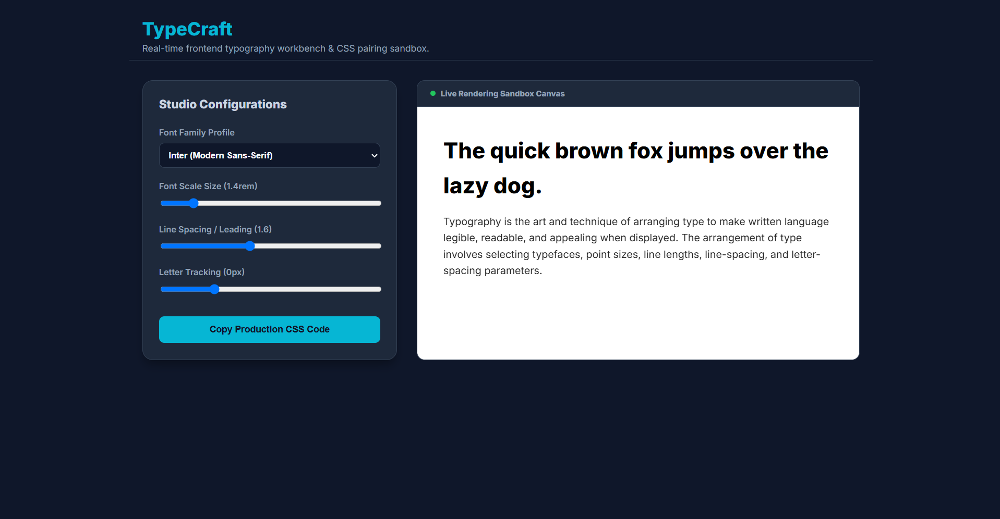

# TypeCraft — Interactive Typography Sandbox
---------------------------------------------------
TypeCraft which is an Interactive Typography Sandbox is a vanilla HTML, CSS, and JavaScript developer application that serves as a visual sandbox utility. It allows developers to test real-time Google Font pairings, inspect line-height layout flow dynamics, alter tracking properties, and export compiled production-ready CSS snippet code blocks instantly.

-----------------------------------------------------------
## TypeCraft Preview 

------------------------------------------------------------
##  Feature Implementation Details
*   **Synchronous DOM Rendering:** Leverages precise JavaScript input handlers to translate data slider values straight into real-time CSS style updates.
*  **Code Compilation Automation:** Compiles custom layout parameters into standardized styling strings and ships them securely to your clipboard.

---------------------------------------------------------------
##  Execution Instructions
    1. Open `index.html` straight into any standard browser or use a VS Code extension like Live Server.
----------------------------------------------------------------------------
